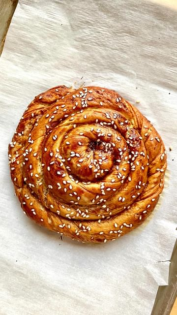

# Tahina rolls! Many variations of these rolls are popular in Armenia and surrounding countries. Simple to make and the perfect breakfast pastry.  

> recipe by [@pierceabernathy](https://www.instagram.com/pierceabernathy/) 
(Pierce Abernathy) - [see original post](https://instagram.com/p/CkYaDPGshf6)

\
ingredients: \
Dough//\
255 grams warm water (105f)\
1 tbsp sugar \
2 tsp yeast\
86 grams unsalted butter\
320 grams flour \
1/2 tsp salt\
\
Filling//\
3/4 cup sugar \
3/4 cup tahini\
1 1/2 tsp cinnamon \
1/2 tsp salt \
\
Egg wash//\
1 Egg yolk\
1 tbsp Date molasses \
\
Sesame seeds to garnish \
\
Preparation:\
1. For the dough, in a large mixing bowl combine the warm water with the sugar and yeast and allow to bloom for 5 minutes. Add the butter, flour and salt and mix until dough forms. Transfer to a clean work surface and knead until smooth dough forms. Cover and let sit for 15 minutes. \
2. For the filling combine the tahini and sugar and set aside.\
3. Preheat over to 375F/190C.\
4. Roll out the dough into a large circle roughly 1/8 inch thick. Spread the tahini filling over dough. Sprinkle ground cinnamon over the filling evenly. \
5. Make a small hole in the center of the dough and carefully begin to push dough away from the center. Letting it roll over itself until the filling is covered and a wreath is formed. Separate into 4 even strands. \
6. Roll out each strand, twisting the dough until strand is roughly 3/4 inch thick. Shape the strand into a pinwheel tucking the exterior edge under the the pastry. Cover and let sit for 15 minutes. \
7. For the egg wash combine the egg yolk and date molasses in a small bowl and whisk to combine. Brush pastry with egg wash and garnish with sesame seeds.\
8. Bake for 20-22 minutes or until golden and cooked through.\
\
\#tahini \#dessert \#pastry \#asmrfood \#cinnamonrolls \#armenianfood 