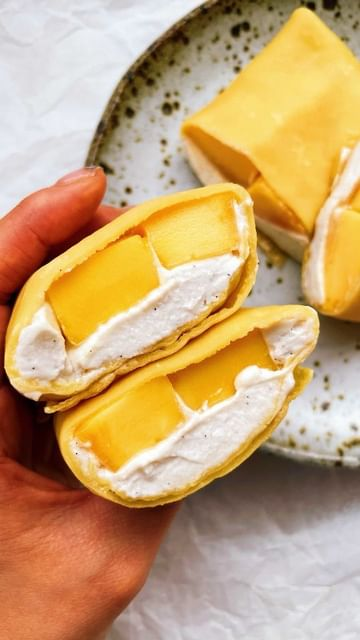

# Hong Kong Mango Pancakes!! 🥭🌞✨  

> recipe by [@plantbased.green](https://www.instagram.com/plantbased.green/) 
(Vegan | Healthy | Recipe) - [see original post](https://instagram.com/p/Cakj0ReKKw1)

\
Follow @plantbased.green 🙌\
Follow @plantbased.green 🙌\
\
📸: Recipe by @itslizmiu\
\
INGREDIENTS\
110g all purpose flour\
2 tbsp icing sugar\
1 cup soy milk \
1 tbsp sunflower oil, plus more for frying \
Up to 3 tbsp water, to thin out pancake batter\
3-4 drops yellow food colouring\
1 drop of pink food colouring\
1 tin @naturescharm Coconut Whipping Cream, refrigerated overnight\
1 tbsp icing sugar\
1/2 tsp vanilla paste\
1 juicy mango, cut into long chunks\
\
METHOD\
Sift flour and sugar together into a large mixing bowl. Add the soy milk and oil and whisk until there are no lumps. Colour with yellow food colouring and just a drop of pink to offset the yellow so you don’t end up with fluorescent yellow pancakes. First make a small test pancake to see if your batter is too thick, we want crepe-like pancakes, but don’t want them to tear when folding. To test your batter, heat a non-stick fry pan on low heat and make sure it’s hot. Brush with some sunflower oil. For a 23cm frypan, pour 1/3 cup batter into the middle and immediately swirl it around. It should cover the entire-base if the batter is thin enough. Cook for about 1-1.5 min or until just cooked, carefully loosen the pancake if it’s not loose already, flip and cook for another 1 min. Allow to cool before folding. To make the cream, whip @naturescharm Coconut Whipping Cream, icing sugar and vanilla paste together for 2-3 minutes on high speed using an electric whisk. To fold your pancakes, place pancake smooth-side-down and place two slices of mango on. Cover with whipped cream and fold up the pancake. Enjoy! 