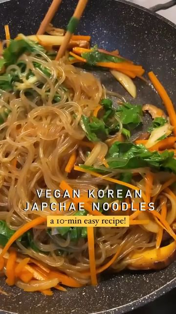

# Vegan Korean Japchae Noodles 😋 

> recipe by [@plantbased.green](https://www.instagram.com/plantbased.green/) 
(Vegan | Healthy | Recipe) - [see original post](https://instagram.com/p/Cb5BeLsKKpU)

On a vegan streak this week with all the vegetables there are in my household so here’s one of my all time fave dishes made vegan! Basically just removed steak and replaced it with shiitake mushrooms.

The sauce combo is key - soy sauce, sesame oil & sugar. So simple but sooooo much flavour and umami. I may have eaten almost the entire pan because it was that good 😛

Follow @plantbased.green 🙌
Follow @plantbased.green 🙌

📸: Recipe by @vernahungrybanana

Ingredients:
- 100g Korean glass noodles 
- thinly sliced onion
- thinly sliced carrot
- shiitake mushrooms, or sirloin steak if not vegan
- leafy greens, usually spinach

Sauce:
- 2 tbsp sesame oil
- 3 tbsp light soy sauce
- 2 tbsp sugar
- 1 tsp white sesame seeds 

\#cooking \#easyrecipes \#veganfood \#veganrecipes \#plantpower \#meatfree \#veggie \#delicious \#homecook \#asianfood \#korean 