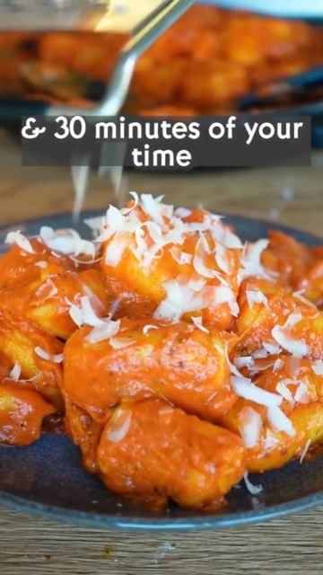

# HOMEMADE GNOCCHI 🇮🇹  

> recipe by [@plantbased.green](https://www.instagram.com/plantbased.green/) 
(Vegan | Healthy | Recipe) - [see original post](https://instagram.com/p/CdVqxxjKsuv)

Making gnocchi takes only 30mins and 3 ingredients… So join me making these delicious, fluffy pillows drenched in garlicky tomato sauce! 🤤

📸: Recipe by @fitgreenmind

RECIPE (3 servings each 495cal/12P/75C/11F):
-500g potatoes
COOK until fork tender/MASH
-1 1/3 cup (175g) flour
-a pinch of salt 
KNEAD/CUT in 4/ROLL KUT strings/SHAPE into gnocchi
Sauce:
-1 onion
-5 cloves garlic
FRY in oil
-1 Tsp each chili flakes, dried oregano, paprika
-3 Tbsp tomato paste 
ROAST it
-1 1/3 cup (330g) tomato sauce
-1/4 cup (60g) vegan cream
-salt to taste 
SIMMER for a bit/COOK gnocchi 3-4mins/STIR them in 