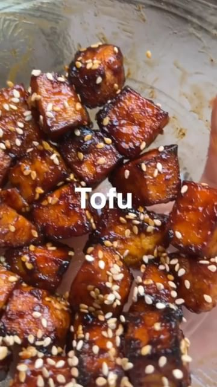

# TWO INGREDIENT Sticky BBQ Tofu 🔥 - for anyone that thinks tofu is boring or can’t taste good. In fact it’s not even two ingredients, its ONE and it’s BBQ sauce. 

> recipe by [@plantbased.green](https://www.instagram.com/plantbased.green/) 
(Vegan | Healthy | Recipe) - [see original post](https://instagram.com/p/CcLCPirKk3k)

📸: Recipe by @sepps_eats

Method:
Chop tofu into cubes, evenly cover in BBQ sauce then air fry for 30 mins @ 180°c shaking half way. Top with extra BBQ sauce and sesame seeds and Enjoy! Serve with rice/in a wrap or salad!

\#tofu \#tofurecipes \#veganism \#veganeats \#plantbasedrecipes 