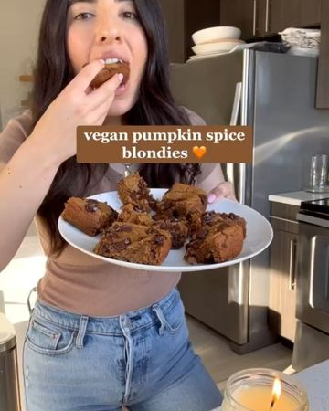

# ✨VEGAN GF PUMPKIN SPICE BLONDIES✨  

> recipe by [@plantbased.green](https://www.instagram.com/plantbased.green/) 
(Vegan | Healthy | Recipe) - [see original post](https://instagram.com/p/CVIaQ0wqg7Q)

\
You can’t taste the chickpeas at all. You need these\
\
Follow @plantbased.green 🙌\
Follow @plantbased.green 🙌\
\
📸: Recipe by @healthygirlkitchen\
\
Recipe: \
1 15 oz can chickpeas\
1/2 cup almond butter\
1/3 cup almond flour\
1/3 cup pumpkin purée\
1/2 cup maple syrup \
1 tbsp almond milk \
1.5 tsp pumpkin spice\
pinch of sea salt \
1/2 cup chocolate chips plus extra for on top \
1 tsp vanilla\
1/2 tsp baking powder\
1/2 tsp baking soda \
\
Use an 8x8 brownie pan. Preheat oven to 350 F. - bake for 35 minutes then let cool for an hour. Store in an air tight container in fridge or on counter. \
e n j o y 😚\
\
\#veganrecipes \#chickpeas \#blondies \#healthybaking \#glutenfreerecipes \#glutenfreeeats \#dairyfree \#dairyfreerecipes \#vegandessert \#plantbaseddiet 