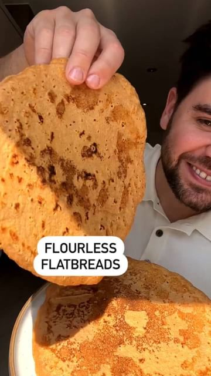

# Flourless Flatbreads 🥳 using red split lentils! Easy to make and naturally gluten-free! 

> recipe by [@plantbasede](https://www.instagram.com/plantbasede/) 
(Healthy | Vegan | Recipe) - [see original post](https://instagram.com/p/CdN91BpKKlR)

\
📸: Recipe by @healthylivingjames\
\
Serves 3 flatbreads\
\
▪️1 cup red split lentils (180g)\
▪️1 cup water (250ml)\
▪️1 tsp paprika\
▪️1 tsp fennel seeds\
▪️1/4 tsp garlic granules\
▪️pinch chilli flakes\
▪️pinch salt\
▪️oil for frying\
\
1️⃣Firstly, rinse the lentils until the water runs clear\
2️⃣Add to a blender along with the water + spices + salt and blend until smooth \
3️⃣Heat a non stick pan with oil until very hot\
4️⃣Pour in the mix, tilt the pan until it forms a round flatbread shape and fry on either side for a couple minutes\
\
FAQ's\
\
➡️How do you serve them? They're awesome with falafels and hummus or event for dipping into curries etc\
➡️Can I freeze them? I think that will work, not personally tried it yet though\
➡️Do you need all the herbs/spices? No, you can just leave them out if you wish I just find it makes them taste even better\
\
\#flatbread \#indianfood \#indianrecipes \#glutenfree \#gluten 