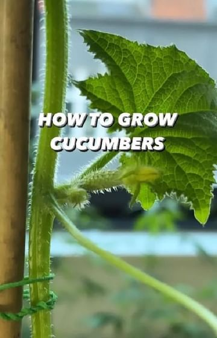

# YES or NO??? How to start growing cucumbers! 🥒🤩 Truly beautiful plants.. the vines are amazing!!  

> recipe by [@plantbasedly](https://www.instagram.com/plantbasedly/) 
(Healthy | Vegan | Recipe) - [see original post](https://instagram.com/p/CdWJfiYqKPX)

Using cinnamon is optional but it is truly magical! 🌱\
.\
📸: Video by @creative_explained\
.\
\
.\
\#cucumber \#plantbased \#garden \#gardening \#plants \#plantsofinstagram \#gardenlife \#lifehack \#hacks \#diy \#recycle \#sustainableliving \#howto \#growyourownfood \#plantstagram \#creativeexplained \#magic \#organicgardening \#instadaily \#tiktokstar 