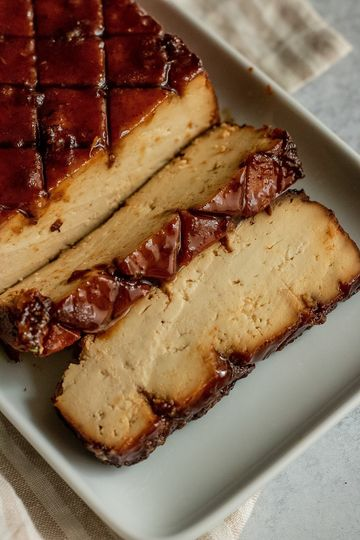

# Want the flavor to actually get into your tofu? Then this Brown Sugar Glazed Tofu is for you and the perfect main for a small crowd of 2-3 (or double it like I do). Hope you enjoy it as much as we did cause we pretty much inhale it every year. 🤣 

> recipe by [@plantbasedrd](https://www.instagram.com/plantbasedrd/) 
(Catherine Perez) - [see original post](https://instagram.com/p/CWgI9M7g0ad)

  
Highly recommend: for more details and how tos for this tofu please visit my blog linked in bio. 🌱  
  
Brown Sugar Glazed Tofu  
  
Tofu Marinade  
1 block of extra firm tofu, pressed and drained  
3 tbsp soy sauce  
Juice of half a lemon  
1 tsp garlic chili sauce  
1 tsp mustard  
1 tsp thyme  
1 tbsp maple syrup  
3 cloves minced garlic  
1/4 small onion, minced  
2 tsp smoked paprika  
2 tbsp nutritional yeast  
  
30-35 whole cloves (the spice)  
  
Brown Sugar Glaze  
3 tbsp brown sugar  
1 tbsp spicy brown mustard  
  
Press and drain your tofu really well before beginning. Place tofu on a clean working surface and taking either a toothpick or needle, poke holes all over the surface of your tofu. Cut a shallow crosshatch pattern into both sides of your tofu. Mix marinade ingredients in a bowl, place tofu into a resealable bag and pour marinade overtop the tofu. Seal bag, gently shake to coat and place in fridge to marinade over night or up to 24 hours for max flavor. Preheat oven to 375F. Remove tofu from marinade bag and place on a lined baking sheet. Place whole cloves into each crosshatch intersection and then place tofu into the oven for 25 minutes. As you remove tofu from the oven, prepare glaze by combining brown sugar and mustard together in a mug. Place in the microwave to warm up for 15 seconds then stir to make a sauce. Carefully baste tofu with a portion of the glaze until it is covered and place back in the oven for 10 minutes. Remove from the oven and with a fork, remove the cloves and brush tofu with more glaze. Place tofu back into the oven and bake for an additional 15-20 minutes or until tofu edges appear to crisp. Remove from oven and allow to rest. With a sharp knife, cut tofu into desired slabs and enjoy.  
  
\#veganthanksgiving \#tofurecipes \#tofu \#veganrecipes \#dinnerideas \#veganfoodshare \#plantbasedprotein  \#veganeats   