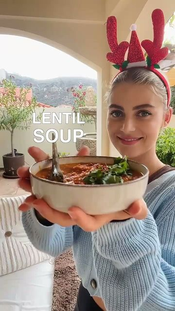

# Please Support & Follow 👉 @thecooking.feed 

> recipe by [@plantbasedvegans](https://www.instagram.com/plantbasedvegans/) 
(Plant Based Vegan) - [see original post](https://instagram.com/p/CXJYoJzKyRG)

Behind the 5th window of the Christmas calendar is this Red Lentil Soup🍲💃 It’s packed with veggies and is such a comfort meal!
Credit by @eatmoreplants.no

Please Support & Follow 👉 @thecooking.feed

Ingredients (8 servings)
Vegetables:
2 tbsp olive oil
1 medium cauliflower
1 sweet potato
2 red bell peppers
1 head garlic

Stew:
1 tbsp olive oil
1 medium onion
4 cloves garlic
1 tsp dried oregano
2 tsp dried basil
0.5 tsp dried thyme
800g diced tomatoes
6 cups vegetable broth
1 cup dry red lentils
4 tbsp tomato paste
1 tbsp balsamic vinegar

Steps:
1. Preheat the oven to 200C.
2. Roughly chop up all your vegetables and spread them out on a baking tray covered with parchment paper. Slice the garlic bulb in two. Drizzle the garlic bulb with olive oil, and place it with the cut side facing down. Bake the veggies for 40-45 minutes.
3. Heat a frying pan over medium high heat, and sauté finely chopped onion and garlic until soft.
4. Now add the oregano, thyme,basil, canned tomatoes, vegetable broth, tomato paste, balsamic vinegar, the roasted veggies and squeeze the roasted garlic out of its skins. 
5. Use a hand blender and blend until smooth.
6. Add the red lentils to the soup and let simmer for about 15 minutes or until the lentils are cooked though.
7. Top with Enjoy! 