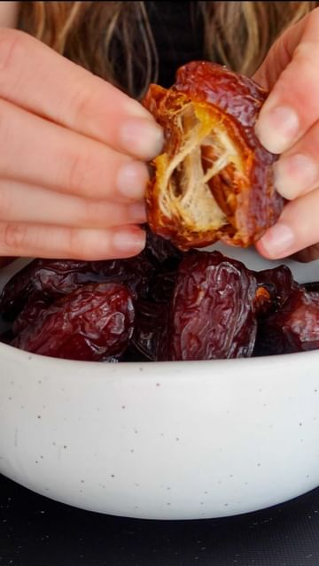

# ☕️💕🌱SCRAPPY COOKING: DATE SEED COFFEE. FOLLOW @plantyou  

> recipe by [@plantyou](https://www.instagram.com/plantyou/) 
(Carleigh Bodrug) - [see original post](https://instagram.com/p/CcBTtzqpYZm)

.
😳Did you know you can turn date seeds into a beverage, reminiscent of coffee without the caffeine? This has been enjoyed in the Middle East for centuries. Date seed coffee has a more subtle flavor, but it’s really delicious and gives you a great excuse to keep those date seeds around.
.
1/2 cup date seeds (around 8 seeds per cup)
.
Preheat the oven to 400F and line a baking sheet with parchment.
.
Remove the seeds from your dates. I used the seeds from medjool dates. Clean thoroughly.
.
Roast on a parchment lined baking sheet for around 40 minutes.
.
After removing from the oven, use a coffee grinder or food processor to create date coffee grinds.
.
Prepare how you would regular coffee. You can mix it with your morning coffee as well, to provide a lower caffeine alternative.
.
What food scraps do you want to see next?
.
\#coffee \#coffeerecipe \#scrappycooking \#easyrecipe \#simplerecipe \#plantbasedrecipe \#plantbaseddiet \#dateseeds \#dateseedcoffee \#eatmoreplants \#plantbasedrecipes \#quickrecipes \#breakfast \#breakfastrecipes \#healthyrecipe \#caffeinefree \#easyrecipe \#quickrecipe \#recipevideo \#lowwaste \#zerowaste \#foodscraps 