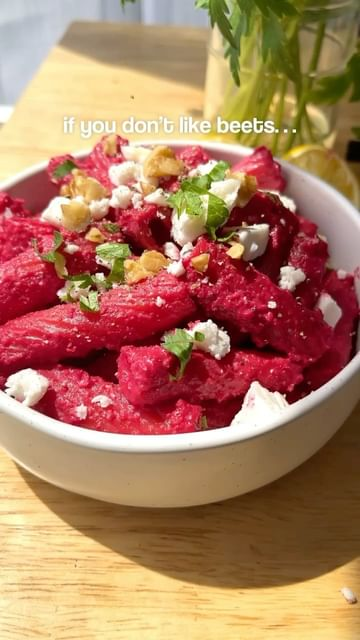

# 🌸 💕✨WOULD YOU TRY THIS PINK PASTA?! BY @plantyou. BOOKMARK & TAG A FRIEND WHO NEEDS THIS. 🤯Colored naturally with beetroot - you won’t believe how incredible it is! 

> recipe by [@plantyou](https://www.instagram.com/plantyou/) 
(Carleigh Bodrug) - [see original post](https://instagram.com/p/Cdblt8Npdgz)

.
SHOPPING LIST
1-2 small beetroots
Cashews
Lemon
Coconut milk
Garlic
Sea salt
Rigatoni (or pasta of choice)
.
💕Full printable recipe on my site at plantyou dot com (just search pink pasta sauce) or linked in bio under “free recipes”
.
Love y’all and happy Wednesday
.
\#vegan \#pasta \#pastarecipe \#beets \#beetroot \#recipe \#easyrecipe \#simplerecipe \#plantbased \#plantbaseddiet \#plantbasedfood \#eatmoreplants \#healthyfood \#healthyeating \#easyrecipes \#vegan \#veganfood \#plantbasedmeals 