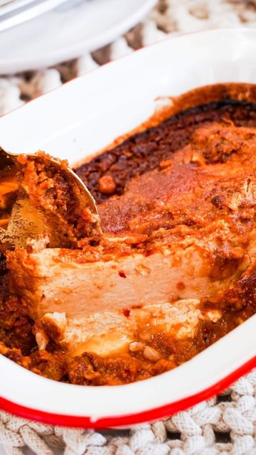

# SATAY BAKED TOFU 🌱  

> recipe by [@plasticfreeherbivore](https://www.instagram.com/plasticfreeherbivore/) 
(Jess | vegan recipes and eco tips) - [see original post](https://instagram.com/p/Cgv0725JuEP)

\
Do you remember the first time you tried tofu? \
\
It was one of those ingredients that was unfamiliar to me so I judged it. Now it is one of my favourite ingredients to use in meals. \
\
This recipe is on my blog (link in bio) or keep reading!\
\
Ingredients:\
\
250 g block of tofu firm\
1/2 cup peanut butter\
1 Tbsp chilli paste or chilli flakes, or fresh chilli\
1 Tbsp apple cider vinegar\
3 Tbsp tamari\
1/8 cup coconut sugar or sugar of choice\
4 cloves garlic diced\
1/2 cup water\
\
Instructions:\
\
Preheat oven to 180 degrees celsius.\
\
Slice along the top of the block of tofu without the knife going through. Approximately 1cm between each slice.\
Add all the other ingredients to a mixing bowl and whisk until well combined.\
\
Place the tofu block in a baking dish. Pour the sauce over the block of tofu ensuring that it is mostly submerged and coated in the sauce.\
\
Bake in the oven for 25 minutes.\
\
Serve with rice and fried greens.\
\
\#vegandinnerrecipes \#veganblogs \#plantbasedblog \#healthyfoodbloggers \#fullrecipe \#wholesomerecipes \#wholesomefoodie \#veganfoodporn \#healthymealshare \#nutritiousrecipes \#nutritiousfoods \#feelgoodfoodplan \#feelgoodfoods \#eatingplants \#eatfortheplanet \#plasticfreefood \#plasticfreefoodie \#plasticfreejourney \#deliciousvegan \#eatingfortheplanet \#sustainableeats \#sustainablefoods \#sustainablerecipes \#recipesforhealth \#easyveganmeal \#simpleveganmeals \#tofurecipes \#tofurecipe \#recipeoftheday \#foodblogoftheday 