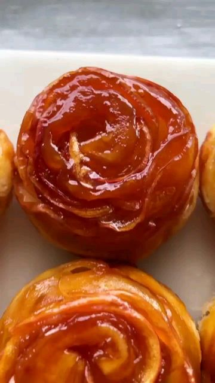

# APPLE ROSE TARTE TATIN - all you need for this luxurious dessert are 3 ingredients you probably already have in your home: apples, store-bought puff pastry and sugar, very minimalistic, but oh, so wonderful  

> recipe by [@recipesviral](https://www.instagram.com/recipesviral/) 
(FOOD | COOKING | RECIPES) - [see original post](https://instagram.com/p/CVf9JMKKIIS)

  
Ingredients (makes 6 tarts)  
  
2 large red apples  
1 sheet of puff pastry  
1 cup of sugar  
  
Instructions   
  
1. Preheat the oven at 200°C or 400°F.   
  
2. Wash, core, then thinly slice the apples using a sharp knife or a mandolin. Soak them in hot water until they become soft and bendable, for about 4-5 minutes. Don’t worry about them oxidizing too much, they’ll end up turning brown anyway. Feel free to add a drizzle of lemon juice or vinegar in the water if you please.   
  
3. Roll out the pastry to 2 mm thick. Divide it into 6 strips. Store-bought puff pastry usually comes folded into 3rds, so that should help dividing it.   
  
4. Place 1/6 of the apples on the top half of each strip, then fold the puff pastry in half to seal the apples in.   
  
5. Roll the strip filled with apples to form a rose. Cut the excess dough off if necessary. Repeat with the remaining apples.   
  
6. Once you have the roses, line a muffin tin with parchment paper, then melt 1 cup of sugar in a pan or saucepan. Simply add the sugar in the pan, and place it on medium heat. Don’t stir it using a spoon, just keep an eye on it and tilt the pan as the sugar melts. Lower the heat if necessary, and stop whenever the sugar turns amber.   
  
7. Pour 1 to 2 soup spoons worth of sugar in each designated spot of the muffin tin. Place the apples roses upside down, with the rose facing the sugar, and press them down.   
  
8. Bake for 25-30 minutes, or until the puff pastry seems cooked, it should feel hard to the touch and have a light golden color.   
  
9. Once you take the pan out, allow the roses to rest in the sugar for 5 minutes, then take them out and serve them. This one’s optional, but some vanilla ice cream or whipped cream would pair really well with these beautiful tarts.  
....  
follow @recipesviral for more  
....  
via @carolinagelen   