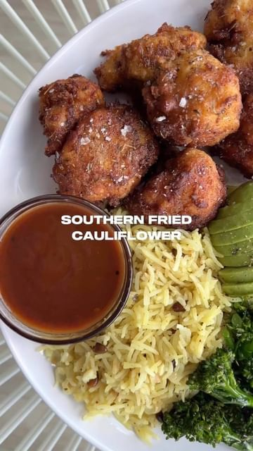

# SOUTHERN FRIED CAULIFLOWER  

> recipe by [@rgveganfood](https://www.instagram.com/rgveganfood/) 
(RG) - [see original post](https://instagram.com/p/Cq0VvPLPjxd)

  
1 head of cauliflower  
1 tbsp garlic granules   
1 tsp smoked paprika  
1 tbsp jerk seasoning  
1 tsp cayenne pepper  
1 tbsp herbes de Provence  
1 tbsp baking powder  
5 tbsp gram flour  
120g self raising flour   
150ml oat milk  
grapeseed oil  
  
Break the cauliflower into florets. Wash and dry throughly.
  
In a shallow bowl, whisk together the chickpea flour and oat milk.   
  
In another shallow bowl, mix together the self raising flour, garlic granules, smoked paprika, herbes de Provence, baking powder, cayenne pepper and jerk seasoning.  
  
Place the cauliflower florets into the gram flour and milk mixture until it is evenly covered. Next, put them into the flour mixture and cover evenly.  
  
Carefully place the coated florets into hot oil and fry for 2-3 minutes until golden.  
  
Served up with fried plantain, corn, roasted tender-stem, avocado, homemade BBQ sauce and pilau rice & toasted pine nuts.   