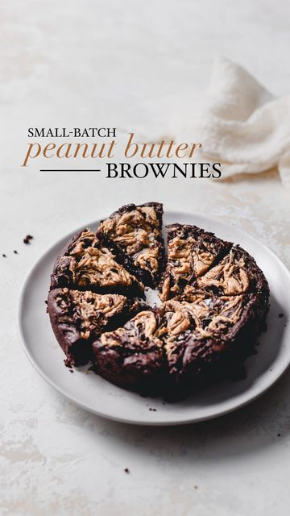

# small-batch peanut butter brownies to satisfy your mid-week fudgy brownie cravings 😋 

> recipe by [@rosslynmaria](https://www.instagram.com/rosslynmaria/) 
(Rosslyn | Food Photographer 🌱) - [see original post](https://instagram.com/p/CaU-gOGJao8)

\
* ingredients *\
\
wet:\
• 1/2 cup coconut sugar\
• 1/4 cup peanut butter\
• 1/4 cup non-dairy milk\
• 3 tbsp water\
• 1 tbsp ground flax\
• 1 tsp vanilla\
\
dry:\
• 1/4 cup all-purpose flour\
• 1/4 cup cocoa powder\
• 1 tsp baking powder\
• chocolate chips (to taste)\
• pinch of salt\
\
peanut butter swirl:\
• 2 tbsp peanut butter\
• 1 tbsp maple syrup\
\
instructions:\
\
1. preheat the oven to 350°f and line/grease a 6 inch cake pan or loaf pan\
2. in a small bowl, combine ground flax and water to create a flax egg (or whisk 2 tbsp of aquafaba)\
3. make the peanut butter swirl by mixing peanut butter and maple syrup together\
4. combine all of the wet ingredients, saving the flax egg till the end\
5. add the dry ingredients to the wet and stir until combined\
6. pour the batter into the baking dish and swirl the peanut butter mixture throughout\
7. bake for 15-20 mins then allow to set and cool completely in the baking dish\
\
full recipe at rosslynmaria.com ✨ enjoy! \
\
.\
.\
.\
.\
.\
.\
 \#foodstylists \#peanutbutterbrownies \#veganbrownies \#veganbrownie \#veganrecipes \#veganbaking \#veganvancouver \#f52grams \#lifeandthyme \#bakersofig \#eatmoremagic \#bakersgonnabake \#thefoodphotographycorner \#brownies \#healthybrownies \#chocolatedessert \#bakingblog \#huffposttaste \#foodphotography \#saveurmag \#easyrecipesathome \#veganchocolate 