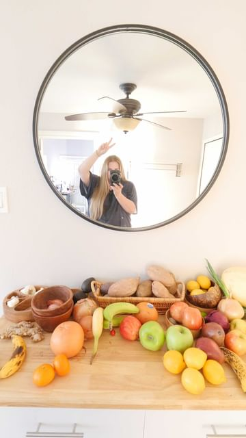

# Compost = ❤️ Preventing Food Waste = 🥰 

> recipe by [@shelbizleee](https://www.instagram.com/shelbizleee/) 
(Sustainability Expert & Speaker - Shelbi Orme) - [see original post](https://instagram.com/p/Cb-Uc2FI0ET)

  
Honestly storing my carrots in water was a GAME CHANGER.   
  
I have some sensory issues & my brains tell me that any food with a slightly off texture is a no-no. But since storing carrots in water they’re one of my fav go to daily snacks 🥕  
  
Drop which food seems to go bad too quickly for you in the comments & I’ll try to include it in part 2!   
  
.⁠  
  
.⁠  
  
.⁠  
  
.⁠  
  
.⁠  
  
.⁠  
  
\#ecofriendly \#sustainable \#foodwasteprevention \#reducefoodwaste  \#fightfoodwaste  \#foodwastewarriors \#nofoodwaste \#foodwasteactionweek \#foodwastetips \#reducewastenow \#foodwaste \#zerowaste \#gogreen \#sustainability \#savefood \#lovefoodhatewaste \#zerowastefood \#ecofriendly \#endfoodwaste \#kitchenhacks \#howtostoreproduce \#groceryhaul   