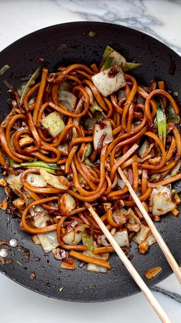

# You’ll also find this recipe in our APP and on our website ✌️ 

> recipe by [@sovegan](https://www.instagram.com/sovegan/) 
(SO VEGAN) - [see original post](https://instagram.com/p/CaW49fSg-ql)

 
10 MINUTE CABBAGE UDON NOODLES 🍜. You might have spotted we’re going through a bit of a ‘noodle’ moment right now. Noodles are one of our go-to speedy meals - and this cabbage udon dish is total winner with toasted cashews and crunchy cabbage. Enjoy 😋
 
Serves 2
 
🌿 40g (1.4oz) cashews, roughly chopped
🌿 vegetable oil
🌿 2 shallots, peeled + sliced
🌿 1/4 cabbage, chopped (see notes)
🌿 3 spring onions, sliced
🌿 3 garlic cloves, peeled + chopped
🌿 300g (10.6oz) udon noodles, we use quick cook noodles (see notes)
🌿 1 tbsp light soy sauce
🌿 1.5 tbsp dark soy sauce 
🌿 2 tbsp maple syrup
🌿 1 tsp toasted sesame oil
 
1️⃣ Heat a wok or pan on a medium-high heat. Throw in the cashews and toast for 2 minutes until golden. Then transfer the cashews to a plate and drizzle a little oil in the wok.
 
2️⃣ Add the shallots and fry for 2 minutes.
 
3️⃣ Then add the cabbage and fry for another 2 minutes.
 
4️⃣ Add the spring onion and garlic and fry for 1 minute.
 
5️⃣ Now throw in the noodles and cashews from earlier, followed by the light soy sauce, dark soy sauce, maple syrup and sesame oil and stir until combined and hot. Then serve.
 
Enjoy! Roxy + Ben
 
Notes:
 
✏️ We use straight-to-wok style udon noodles, also known as ‘quick cook’ noodles, which only require minute in a hot pan to cook through. Alternatively you can use dry noodles and cook them separately in a pot of hot water, then drain them and add them to the wok.
 
✏️ We use regular green cabbage, which is the most common variety you’ll find in supermarkets. But you can also use Chinese cabbage (also known as napa cabbage) or even Savoy cabbage.
 
✏️ You can always throw in any other veggies you might have lying around. Courgette, carrot and mushrooms will work really well in this recipe too. 