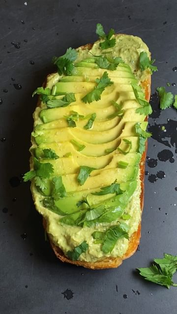

# Creamy Avocado Yoast 

> recipe by [@sweatspace](https://www.instagram.com/sweatspace/) 
(Mike Martin) - [see original post](https://instagram.com/p/CbJM368F3k9)

Sourdough topped with a spicy avocado yogurt spread made with @siggisdairy plain yogurt, avocado, garlic, cilantro, jalapeño, lime, chipotle, cayenne pepper, salt

For the spicy avocado spread, add the following to a food processor: 3 cloves garlic, 1 jalapeño deseeded or keep some seeds if you want it more spicy, 2 medium ripe avocados, 1 Siggi’s plain yogurt, small bunch cilantro (about 20 stems), 2 squeezed limes (more if too spicy for your liking), 1/4 tsp cayenne pepper, 1/4 tsp chipotle powder, salt to taste then blend for about 1 minute or until smooth

This spread not only goes great on toast, it’s also great as a dip as well! The Siggi’s yogurt makes it super creamy plus adds extra protein as well! Store in an airtight container in the fridge or eat immediately

Toast your sourdough with olive oil, top with the spicy avocado spread, sliced avocado, juice of a lime, flaky sea salt and cilantro

Hope you enjoy this super simple, yet delicious spread!

\#sweatspace \#toastlikemike \#toasttuesday \#siggisdairy \#yoast \#yogurttoast \#avocadotoast \#siggis \#viral \#breakfastideas 