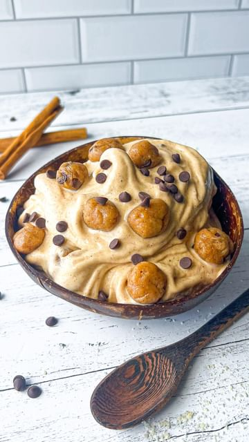

# Let’s make COOKIE DOUGH Nice Cream 🍪🍌 with the help of @ninjakitchen #SponsoredbyNinja 

> recipe by [@that.veganbabe](https://www.instagram.com/that.veganbabe/) 
(Stephanie Manzinali) - [see original post](https://instagram.com/p/CcODkGztXqI)

 
My latest obsession is my Ninja® TWISTI™️ High-Speed Blender DUO!! 🙌 It’s SO powerful I know it can handle any new crazy or viral recipe I throw at it and blend through it with ease 😎 

Not only is it insanely powerful, it also has a twist tamper which pushes all of your ingredients into the blade so you can get ULTRA thick & creamy outputs with minimal liquid!! 🤤😍

I love that it has a removable drizzle cap so you can completely control the amount of liquid or other ingredients added to get the perfect 👌 texture and flavour! 

And when I’m making a smoothie, spread, or frozen drink all I have to do is pick one of the 5 preset Auto IQ® buttons which blends it up perfectly every time! 🎉

For the Ice Cream 🍦 you’ll need

✨ INGREDIENTS✨
4 frozen bananas
1 tbsp peanut butter
1/2 scoop vegan vanilla protein powder
1/4 tsp vanilla

3/4 cup almond flour
3 tbsp almond butter
1/4 cup maple syrup
1 tsp vanilla
Pinch of salt
2 tbsp vegan chocolate chips 🍫

✅ First blend up the ingredients for your banana ice cream! I used my \#NinjaBlender to get the creamiest output!

🤗 Next blend up the ingredients for the cookie dough using the small cup attachment and stir in your chocolate chips.

🥄 Break up the cookie dough into bite sized pieces and mix it into your nice cream.

😋 Top with extra cookie dough and chocolate chips and enjoy!!

\#nicecreamrecipes \#highspeedblender \#cookiedoughnicecream \#vegancookiedough \#vegancookies \#healthyicecream \#veganicecream \#dairyfreeicecream \#vegandessert \#easyrecipe \#easydessert \#nicecream \#ediblecookiedough 