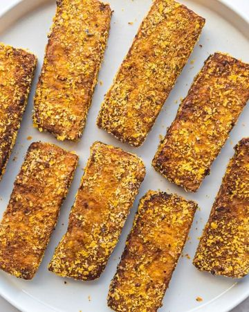

# 🙌😍 How to Make CRISPY TOFU!!! 

> recipe by [@that.veganbabe](https://www.instagram.com/that.veganbabe/) 
(Stephanie Manzinali) - [see original post](https://instagram.com/p/CVODo7VMMY8)

\
1. Use Extra Firm Tofu\
2. Press your tofu for at least 15 minutes, but the longer the better!\
3. Use cornstarch in your seasoning!\
4. Air fry & flip halfway through cooking\
\
🔥 You can bake as we it will just take a little longer - about 30 min as opposed to 15 in the air fryer\
\
✨This tofu steak recipe is one of my go to’s! I eat it at least twice a week & it’s super simple to make!✨\
\
✨Tofu Steak Ingredients✨\
\
1 block tofu\
3 tbsp soy sauce\
1/2 cup nutritional yeast\
1 tbsp cornstarch\
1 tsp steak spice\
\
🔪 Slice your extra firm pressed tofu into strips\
\
🧄 Add soy sauce to one bowl & seasonings to another.\
\
🥣 Dunk your tofu in the soy sauce then into the nooch mixture.\
\
👌Air-fry @ 400f for 14-16 minutes flipping halfway though! Or bake @ 400 for 25-30 min flipping halfway.\
\
😋 Thank you for watching & enjoy! \
\
\#tofusteak \#tofurecipes \#tofu \#easyveganmeals \#easyveganrecipes \#veganmealideas \#easyrecipes \#crispytofu \#veganrecipes \#veganfoodshare \#quickveganmeals \#vegansofig \#veganfood \#tofulover 