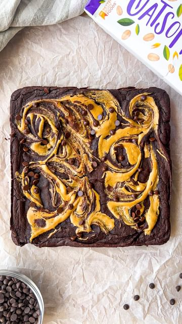

# 🎉😍 Fudgy Protein Borwnies with @oatsomeoatmilk 🙌 #ad  

> recipe by [@that.veganbabe](https://www.instagram.com/that.veganbabe/) 
(Stephanie Manzinali) - [see original post](https://instagram.com/p/CcqSD0EMS9k)

  
I absolutely love 😍 the \#OatsomeOatMilk & what a perfect swap to help reduce your environmental impact this \#EarthDay !🌱 Oatsome’s milks are ULTRA creamy, great for frothing and made with 100% organic whole grains!   
  
🌎 AND did you know that oats are one of the most sustainable gains on the planet and oat milk:  
  
✨Requires 80% less land than cows milk  
✨Produces 80% less greenhouse gas emissions than cows milk  
✨Uses 80% less water than almond milk 🤯   
  
The perfect addition to these fudgy brownies! 😋 Here’s how to make them:  
  
✨INGREDIENTS✨  
1 can black beans (1.5 cups)  
1/2 cup peanut butter  
1/4 cup maple syrup  
5 tbsp cacao powder  
1 cup \#Oatsome Oat Milk  
1/2 cup vegan chocolate protein powder   
1 tsp baking powder  
2 tbsp peanut butter for swirling  
2 tbsp vegan chocolate chips  
  
🙌 Add your ingredients into a high speed blender and blend until completely smooth!  
  
🍫Pour into a 9x9 baking tray, swirl in some peanut butter and top with some vegan chocolate chips!  
  
🔥 Bake at 350f for 25 minutes and LET THEM COOL COMPLETELY! This will let the brownies set!  
  
😋 Enjoy and thanks for watching!  
  
✨MACROS✨ per slice (9 slices)  
300 cals - 17P - 34C - 13F  
  
\#veganbrownies \#proteinbrownies \#highproteindiet \#veganprotein \#healthydessert \#highproteindessert \#healthybrownies \#blackbeanbrownies \#veganprotein \#easydessert \#brownierecipe \#plantbaseddessert \#easyveganrecipes   