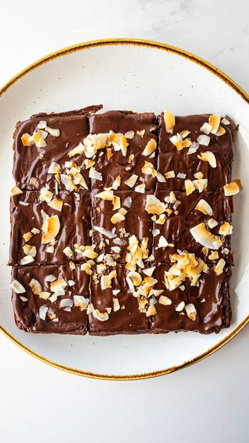

# 🌱🍠🍫 Sweet Potato Brownies! 

> recipe by [@that.veganbabe](https://www.instagram.com/that.veganbabe/) 
(Stephanie Manzinali) - [see original post](https://instagram.com/p/CVbAmAAP2T4)

🙌These brownies are fudgey, filling & satisfying - and no you can’t taste the sweet potato at al! 🤯

💪 I use @outcastmission protein powder! Use code VEGANBABE to save 🎉 

✨INGREDIENTS✨
2 cups sweet potato
1/3 cup chocolate protein 
4 tbsp cacao powder
1/2 cup oat flour
1/3 cup almond butter
2 flax eggs
3 tbsp maple syrup
1 tsp baking powder
Coconut shreds for topping 

Chocolate sauce:
3 tbsp cacao powder
1.5 tbsp maple syrup
1.5 tbsp plant milk

😋 Cook your sweet potato in the microwave or oven 

🙌Add everything into your blender & blend until smooth, scraping down the sides as needed.

🔥 Bake for 35-40 minutes @350f then let cool completely

👌Mix the chocolate sauce then pour on top with some coconut shreds & enjoy!

\#sweetpotatobrownies \#healthybrownies \#veganbrownies \#vegandessert \#plantbaseddessert \#veganrecipes \#healthydessert \#vegandessertrecipes \#dairyfree \#glutenfreebaking \#veganrecipes \#easyvegan \#whatveganseat 