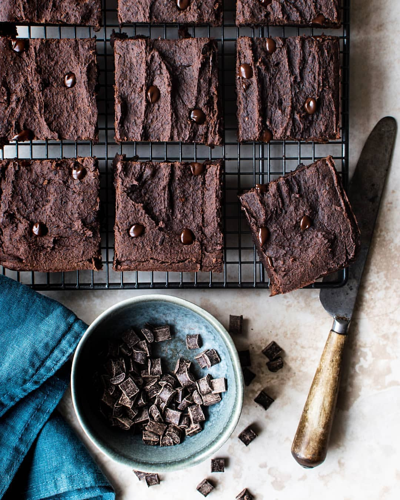

# BLACK BEAN, TAHINI & MOLASSES CHOCOLATE BROWNIES  

> recipe by [@the_balanced_kitchen](https://www.instagram.com/the_balanced_kitchen/) 
(Joanne|Food|Photography) - [see original post](https://instagram.com/p/BqaNXUznQNu)

I love tahini.  I love chocolate. I love anything which sneaks a bit of extra goodness in 🤫 it’s hard to believe that a chocolate brownie could be so good for you as these are and still taste so deeelicious 😋  
  
INGREDIENTS  
  
480 g black beans 2 tins, drained  
140 g tahini  
100 g granulated molasses (do not use syrup) or use coconut or brown sugar  
2 very ripe bananas  
40 g cacao powder  
1 tsp vanilla bean paste  
1 tsp baking powder  
2 tbsp ground chia seeds  
1 pinch sea salt  
100 g dark chocolate chips  
  
INSTRUCTIONS  
You will need a 20x20cm brownie tin & food processor for this recipe.  Pre-heat the oven to 180 degrees C.  
  
Place all the ingredients (excluding the chocolate chips) into a food processor and blitz until smooth.  
  
Remove the jug from the food processor and stir through the chocolate chips.  
  
Add the brownie mixture to the tin and evenly spread out the mixture with the back of a spoon.  
  
Bake the brownies in the oven at 180 degrees C for 20-25 mins or until a skewer comes out clean.  
  
Allow the brownies to cool for around 30 mins before serving.  They taste even better the following day when they have had a chance to cool completely in the fridge.  Just be sure to place a piece of kitchen roll in the bottom of a lidded container when storing to collect any moisture/condensation.  
  
\#foodblogfeed \#flatlaytoday \#FoodBlogger \#foodieflatlays \#makesmewhole \#hownottodie \#thecookfeed \#worldwideveganfood \#veganvultures \#healthybaking \#foodgawker \#eattheworld \#vegan \#healthbloggerscommunity \#worlwideveganfood \#thrivemags \#letscookvegan \#fromscratch \#foodstyling  
\#kaylaitsines \#slimmingworld \#makeitdelicious \#tastingtable \#eatplants \#worldwideveganfood \#buzzfeast \#foodie_features \#gloobyfood \#wholefoodsfavs \#bestofvegan   