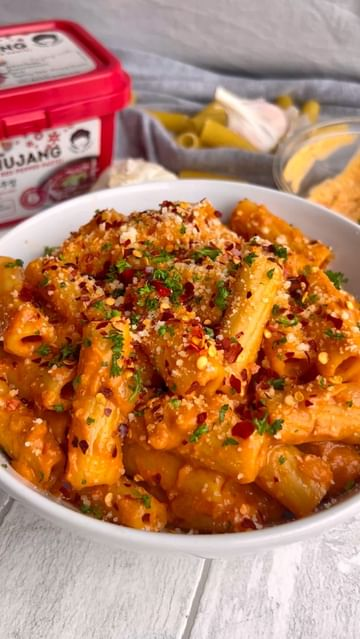

# GOCHUJANG HUMMUS RIGATONI🍝🌶 

> recipe by [@theegyptianplanteater](https://www.instagram.com/theegyptianplanteater/) 
(Farida🌸 plant-based foooodie🌱) - [see original post](https://instagram.com/p/CcBDPFjqUZt)

I love creamy pasta. I love gochujang. I love hummus. Soooo really this pasta just makes sense, right??! And TRUST me it’s SOOOO good and makes the perfect weeknight dinner! You can thank me later :):)  
  
Ingredients: (serves 2)  
- Around 200g rigatoni   
- 1 white onion   
- 3 garlic cloves, minced   
- Vegan butter - the more the merrier - I used a heaped tbsp  
- 1-2 tablespoons of gochujang, I use   
- 4-5 tbsp hummus, I used red pepper   
  
Garnish:   
- Chilli oil   
- parsley   
- Vegan Parmesan   
- Chilli flakes   
  
Method:   
- sauté onion & garlic in butter until translucent   
- Add gochujang and cook for 2-3 mins until fragrant   
- Add in pasta water and hummus   
- Aaaand more pasta water if you want it thinner!   
- Add in your pasta   
- Garnish & enjoy!! Yes it’s that simple!!   