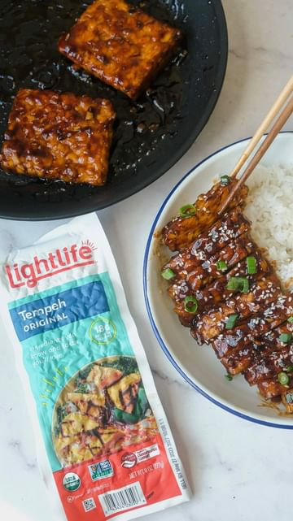

# Maple Hoisin Tempeh using @lightlifelifefoods original tempeh ✨ #lightlifepartner #ad 

> recipe by [@thefoodietakesflight](https://www.instagram.com/thefoodietakesflight/) 
(Jeeca • Vegan Recipes 🥢) - [see original post](https://instagram.com/p/CqeSeeppsnC)

  
Each serving of tempeh has 18 grams of protein, plus it’s a fermented food making it good for gut health. This recipe is really simple and easy to prepare but packs so much flavor!  
  
Get the recipe 👇🏼  
  
Maple Hoisin Tempeh  
Serves 2 people  
  
Tempeh  
1/2 lb Lightlife Foods Original Tempeh (1 pack)  
Neutral oil, for cooking  
  
Sauce/Marinade  
2 tbsp hoisin sauce  
2-4 tbsp  maple syrup adjust according to desired sweetness, (see notes)  
1 tsp minced garlic  
1 tsp dark mushroom soy sauce, for colour (optional)  
2 tsp sesame oil  
2 tsp sriracha or other chili sauce, adjust according to desired heat  
  
Cooking and Serving  
1 tbsp water, to deglaze the pan  
Green onions, for garnish  
Sesame seeds, for garnish  
Steamed rice  
  
STEPS   
Slice the tempeh into half and into smaller pieces, if desired.   
Heat a large skillet or non-stick pan over medium high heat. Add some oil to coat the pan. Once hot, add the slabs or pieces of tempeh.  
Cook the tempeh over medium high heat until golden brown, around 3-4 minutes on each side.  
Prepare the sauce or marinade by mixing everything in a bowl. Feel free to adjust the sauce to your taste.  
Pour the marinade or sauce over the tempeh and flip the tempeh to evenly coat in the sauce.  
Allow the sauce to come to a boil over medium heat. It’ll thicken and turn into a glaze from the sugars.  
Flip the tempeh to continue to cook in the sauce and coat in the glaze.  
Once the tempeh has soaked the sauce. you can deglaze the pan with some water.  
Turn off the heat and then transfer the tempeh into plates. You can slice these into strips if you opted to cook them in square slabs.  
Serve with rice or noodles. You can also enjoy the tempeh in wraps or salads.  
Pour the remaining sauce/marinade over the tempeh.  
Garnish with green onions or sesame seeds, if desired. Enjoy!  
  
\#lightlife \#tempeh \#veganrecipe \#foodvideo \#veganfood \#plantbased \#plantprotein \#asianfood \#hoisinsauce \#maplesyrup \#easyrecipe   