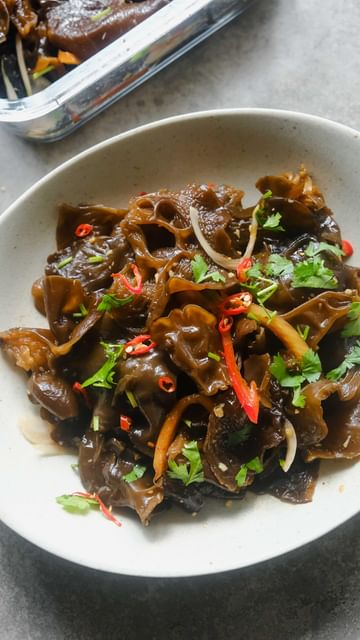

# Wood Ear Mushroom Salad 🍄🥗 

> recipe by [@thefoodietakesflight](https://www.instagram.com/thefoodietakesflight/) 
(Jeeca • Vegan Recipes 🥢) - [see original post](https://instagram.com/p/Cq8Ggq0pP_0)

  
Get the recipe on www.thefoodietakesflight.com - direct recipe is also linked in my bio @thefoodietakesflight! ✨  
  
This is packed with those crunchy wood ear mushrooms or black fungus with garlic oil, soy sauce, black vinegar, onions, cilantro, and some chiles for heat. Perfect as a starter or side dish. 😋  
  
https://thefoodietakesflight.com/wood-ear-mushroom-salad  
.  
.  
.  
.  
.  
.  
\#thefoodietakesflight \#mushrooms \#salad \#blackfungus \#foodreels \#chinesefood \#sichuan \#spicy \#letscook \#vegetarian \#f52grams \#recipevideo \#asmrvideo \#asmrfood \#asianfood \#foodies \#asiancooking \#heresmyfood \#tastemademedoit \#asianfoodporn \#asianblogger \#eatrealfood \#food52   