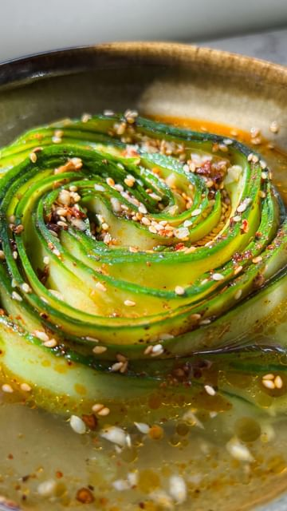

# This is a light, refreshing, and crisp Chinese cucumber salad with a simple sweet & tangy dressing and a generous drizzle of homemade chili oil & sesame seeds. 🌹 

> recipe by [@thefoodietakesflight](https://www.instagram.com/thefoodietakesflight/) 
(Jeeca • Vegan Recipes 🥢) - [see original post](https://instagram.com/p/ComyWrUpXNC)

  
🥒full recipe’s on my website www.thefoodietakesflight.com - direct link is also in my bio @thefoodietakesflight ◡̈  
  
www.thefoodietakesflight.com/chinese-cucumber-rose-salad  
.  
.  
.  
.  
.  
.  
\#thefoodietakesflight \#foodreels \#cucumber \#salad \#easyrecipes \#letscook \#vegetarian \#f52grams \#recipevideo \#salads \#cucumbersalad \#chilioil \#asianfood \#foodies \#asiancooking \#heresmyfood \#refreshing \#asianfoodporn \#asianblogger \#eatrealfood \#food52   