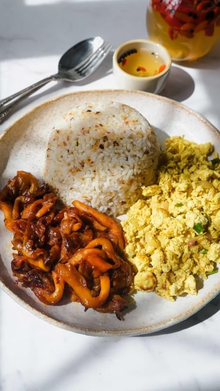

# Filipino Mushroom Tocino with tofu scramble and sinangag (fried garlic rice) 🫶🏼 

> recipe by [@thefoodietakesflight](https://www.instagram.com/thefoodietakesflight/) 
(Jeeca • Vegan Recipes 🥢) - [see original post](https://instagram.com/p/CdlLj2JpgMX)

\
What did you grow up eating for breakfast? 🌞 \
\
I usually had a hearty rice meal and very popular Filipino breakfast (but also good anytime of the day, really!) were ‘silog’ meals—“si” standing for sinangag (si) or fried garlic and itlog (log) or egg.  So if I had tocino with fried garlic rice and egg, we’d call it Tocilog/Tosilog ◡̈ \
\
👉🏼you’ll find both recipes for my mushroom tocino and fried garlic rice up on the blog https://thefoodietakesflight.com! You can also just click on the link in my bio @thefoodietakesflight 🍄\
\
Happy Sunday!! ☀️\
\
https://thefoodietakesflight.com/vegan-mushroom-tocino\
\
.\
.\
.\
.\
.\
.\
\#thefoodietakesflight \#foodreels  \#foodasmr \#mushrooms \#oystermushrooms \#veganfoodie \#filipinofood \#veganph \#breakfast \#vegetarian \#f52grams \#tocino \#asmrvideo \#asmrfood \#asianfood \#foodies \#asiancooking \#heresmyfood \#asmrsounds \#asianfoodporn \#asianblogger \#eatrealfood \#food52 