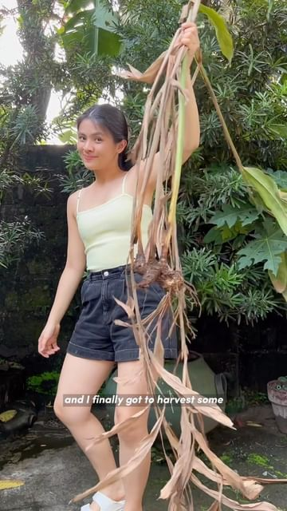

# This harvest was a year and a half in the making. 🥹 

> recipe by [@thefoodietakesflight](https://www.instagram.com/thefoodietakesflight/) 
(Jeeca • Vegan Recipes 🥢) - [see original post](https://instagram.com/p/Ck_AYjeJOpa)

Fresh galangal is difficult to come by in Manila 🇵🇭 so I’m rly grateful for this plant no growing in my backyard 🌿

Tom yum essentials:
- Galangal (tho I’ve made it with ginger + bit of pepper in the past, BUT galangal rly is the best still)
- Kaffir/makrut lime leaves
- Lemongrass
- Plus off a few other key ingredients!

✨Tom Yum Soup recipe on my blog 🥣

Tom yum soup reel coming up next!!
.
.
.
.
.
.
\#thefoodietakesflight \#foodreels \#galangal \#harvest \#garden \#lemongrass \#gardening \#asianfood \#asiancooking \#heresmyfood \#kaffirlime \#tomyum \#thaifood \#asianblogger 