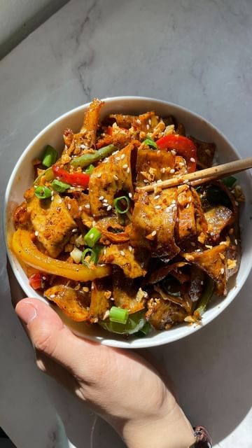

# Garlic Pepper Tofu! 🥢 

> recipe by [@thefoodietakesflight](https://www.instagram.com/thefoodietakesflight/) 
(Jeeca • Vegan Recipes 🥢) - [see original post](https://instagram.com/p/CsbVuH9OtHR)

  
Full recipe on www.thefoodietakesflight.com - link in bio @thefoodietakesflight ✨  
  
Thin strips of extra firm tofu cooked down in a savory, sweet, garlicky, and peppery sauce. I used a peeler to get thin strips of extra firm tofu that I air-fry to draw out any excess moisture and cook down in the sauce to soak up all the flavors.  
  
You can also add vegetables to the stir-fry and serve this over a bowl of steamed 🍚  
  
www.thefoodietakesflight.com/garlic-pepper-tofu  
.  
.  
.  
.  
.  
.  
\#thefoodietakesflight \#foodreels \#foodasmr \#yummyph \#veganfoodie \#plantpower \#veganph \#letscook \#vegetarian \#f52grams \#recipevideo \#asmrvideo \#asmrfood \#asianfood \#foodies \#asiancooking \#heresmyfood \#tastemademedoit \#asianfoodporn \#asianblogger \#eatrealfood \#food52   