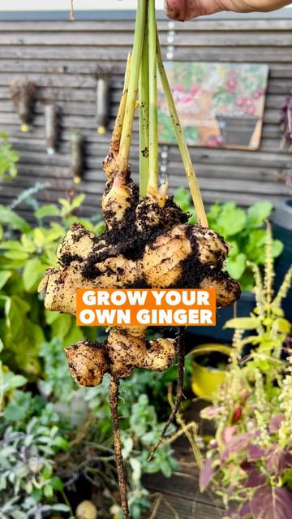

# How to grow your own Ginger at home 🌱💚 

> recipe by [@thefrenchiegardener](https://www.instagram.com/thefrenchiegardener/) 
(Patrick Vernuccio) - [see original post](https://instagram.com/p/CoaKWxqK2Lz)

  
You would be surprised how easy it is to grow your own organic ginger in pots & containers! It requires patience but almost no maintenance.   
  
* Follow @thefrenchiegardener to learn how to grow your own food in pots & containers, on your balcony, terrace or patio *  
  
Out of one organic ginger rhizome, you can harvest many new ones and the growing process is easy!   
  
Step by step explanations :  
🌱 Buy an organic ginger at your local market. Organic is important to make sure it is not treated with anti-growth/sprout products. Your Ginger will need to sprout.  
🌱 Keep your ginger rhizome indoor in a small plate with water. Spray water every day to keep it humid.   
🌱 After a few weeks, it will develop sprouting eyes. Stems will develop and grow from these eyes.   
🌱 Plant your rhizome in a pot of 4L / 1 Gallon, water regularly & keep indoor at warmth. Green stems will develop in a few weeks.   
🌱 After your last spring frost date, plant out outdoor in a bigger pot of minimum 20L/ 5 Gallon. You can add some mulch. Place in half sun half shade location. Water regularly.   
🌱 Without any big maintenance, after 9/10 months, your ginger will be ready for harvest. The taste of homegrown ginger has truly no comparison. Fresh & tasty!  
  
Indeed Ginger has also many health benefits. I love to have a shot of ginger/turmeric in the morning! It’s great for the immune system!  
  
If you like this Reel, please share it in your stories to support me & to educate others 🙌🏼  
  
Green Love to you 💚  
  
\#plantbased \#growyourownfood \#diyideas \#gardening   