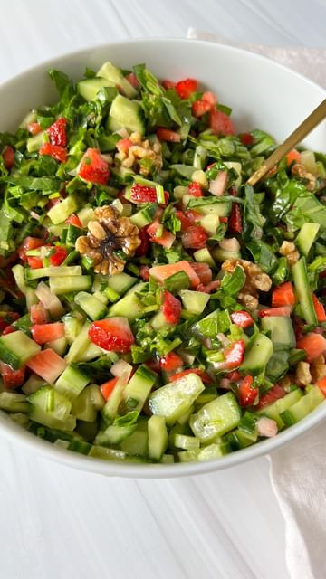

# Thank you for 6million 🥂The best strawberry green salad with a dressing I could chug. If you are tired of boring salads, trust me on this one as it will be on rotation. The magic is in the dice and in the dressing. You are more than welcome to adjust ingredients and make it according to your lifestyle. If you are plant-based I would suggest you use regular Dijon mustard and add maple syrup or agave to it instead. This recipe makes one large portion or 2 small. There is no exact recipe as you can taste and adjust and add as much or as little veggies as you like. You will need: 

> recipe by [@themodernnonna](https://www.instagram.com/themodernnonna/) 
(Snejana Andreeva) - [see original post](https://instagram.com/p/CaipDW4AC4Q)

⠀⠀⠀⠀⠀⠀⠀⠀⠀⠀⠀⠀  
For the Salad:  
1/2 of a finely diced English cucumber — or any  
1/4 cup of finely diced chives — you can use green onion too  
one bunch of finely sliced baby spinach — about 3-4 cups total  
1 cup of finely diced strawberries — I used 10 strawberries  
6-7 walnuts are optional  
⠀⠀⠀⠀⠀⠀⠀⠀⠀⠀⠀⠀  
The Dressing:  
2-3 tablespoons olive oil  
1 tablespoon white balsamic vinegar — any acidity works  
1 tablespoon honey dijon mustard  
salt and pepper to taste  
⠀⠀⠀⠀⠀⠀⠀⠀⠀⠀⠀⠀  
✨You can find the full printable recipe with tips and directions on my website which is linked in my bio. Search for “ Strawberry Salad ” in the search tab on my blog and it will pop right up 🌐www.themodernnonna.com  
  
⠀⠀⠀⠀⠀⠀⠀⠀⠀⠀⠀⠀  
\#themodernnonna \#salad \#saladrecipe \#saladideas \#salads \#saladsofinstagram   