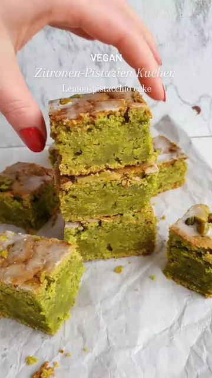

# Pistachio Cake  

> recipe by [@theplantbasedmeal](https://www.instagram.com/theplantbasedmeal/) 
(Plant Based Meal) - [see original post](https://instagram.com/p/CcEmG2EMcn8)

The most saved recipe I have ever posted- For a reason! It's SO good 💚have you tried it yet?? 
By @ginamarie.grimm 

Ingredients: 
180 g melted vegan butter 
1/2 cup 100 g (cane) sugar
1/4 cup 60g agave syrup
5 cubes 65g of frozen spinach leaves (or fresh) 
1 pinch of salt 
1/2 cup 80 g pistachios 
1+3/4 cup 250 g flour (e.g. wheat type 550) 
1 tsp apple cider vinegar 
1 tbsp. lemon juice 
zest of 1 large or 2 small lemons 
1 cup 250 ml plant milk 
1/2 tsp baking soda 
1,5 tsp baking powder 

* 2 tsp. baking powder instead of apple vinegar + natron works as well 

Topping: 
1 tbsp. Icing sugar 
1 tsp aquafaba or water 
A few chopped pistachios 

Method: 
Puree the spinach+ plant milk+ pistacchios and mix with the remaining ingredients. Pour into a baking pan lined with baking paper (21x21cm) and bake in the preheated oven, top-bottom heat 180°C/350°F) for 40 min. Let cool, decorate and enjoy 🥰. 