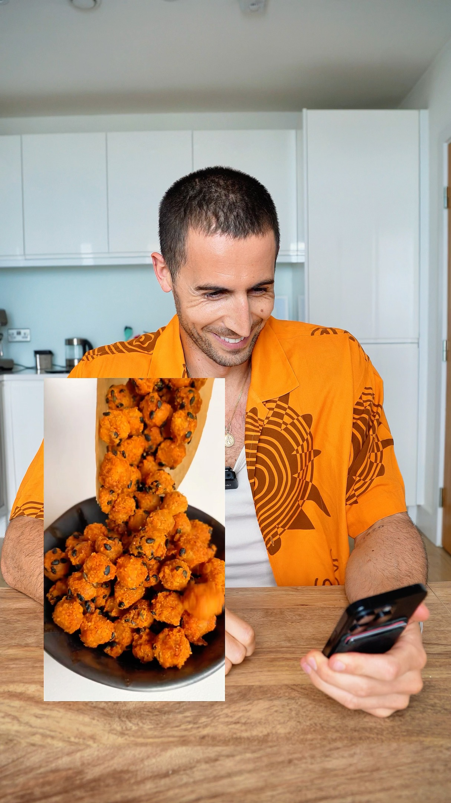

# High Protein Chickpea Popcorn 🍿. Yes or NO? Recipe 👇 

> recipe by [@tomseniorfitness](https://www.instagram.com/tomseniorfitness/) 
(Tom Senior) - [see original post](https://instagram.com/p/DK1TKqeimw-)

  
240g Chickpeas   
60ml Tahini   
1tbs Paprika (I used smoked)  
1tbs salt   
1tbs pepper  
  
Oven for 25 minutes on 200. Enjoy!   
  
Per serving - 200 calories & 16.5g protein.   
  
Let me know what you think!  
  
Thank you @epicmintleaves for your creation! 🙏🏼  
  
If you need more high protein cooking inspiration comment COOKBOOK below and I’ll send over my High Protein Cookbook Bundle 🥗  
  
\#popcorn \#proteinpopcorn \#highfiber \#vegan \#glutenfreesnacks   