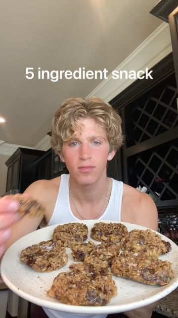

# These cookies are a game charger for quick mornings, an easy snack, or even dessert 😌 Follow @tracesoats for more!  

> recipe by [@tracesoats](https://www.instagram.com/tracesoats/) 
(Trace’s Oats) - [see original post](https://instagram.com/p/CcMYGAuFTh5)

  
𝘿𝙚𝙩𝙖𝙞𝙡𝙨:  
- 1/2 cup peanut butter  
- 2 mashed ripe bananas  
- 1 1/2 cup rolled oats  
- 1 tsp vanilla extract  
- Mix ins (chocolate/nuts/sprinkles)  
  
𝙏𝙤𝙥𝙥𝙚𝙙 𝙬𝙞𝙩𝙝:  
- flakey salt  
  
𝘿𝙞𝙧𝙚𝙘𝙩𝙞𝙤𝙣𝙨:  
1) Mix bananas, peanut butter, and vanilla  
2) Fold in oats  
3) Let it sit in fridge for 10 minutes to thicken  
4) Add in mix ins  
5) Bake @ 350°F for 12-15 minutes   
-  
-  
-  
\#discover \#reels \#reelsinstagram \#tiktok \#reel \#discovery \#fyp \#foryou \#foryoupage \#healthy \#food \#foodie \#healthyfood \#healthyfoodie \#healthyrecipes \#insta \#instagood \#reel \#reels \#instareels \#yummy \#bananacookies \#banana \#bananas \#cookies \#cookie \#healthycookies \#healthycookie   