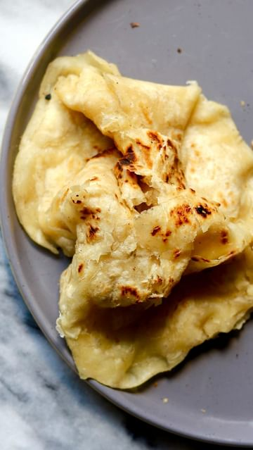

# Buss Up Shut! I have shared this before but here it is again! This recipe never fails me, even when I rush it, it is always deliciously flaky! Had the pleasure of visiting Trinidad for two weeks this year and so happy I can recreate one of my favourite treats from the trip! 👌🏿  

> recipe by [@travelandmunchies](https://www.instagram.com/travelandmunchies/) 
(Travelandmunchies) - [see original post](https://instagram.com/p/Cghkuqxl-b2)

  
Flat bread like this has many names and many countries of origin. Depending where you are from, flat bread may be predominantly called paratha, roti, buss up shut, chapati, M'semen to name a few. Though these flat breads may be named AND prepared differently depending on country and region, in Trinidad paratha, roti and buss up shut are often used interchangeably to refer to what I am making here!   
  
Enjoy ❤️  
  
Original recipe by @immaculatebites   
  
Ingredients   
- 3 cups all purpose flour  
- 1 teaspoon sugar  
- 2 teaspoons baking powder  
- 1 1/2 teaspoon salt  
- 1 tablespoon ghee, butter or oil  
- 1 1/4 cup warm water or slightly more  
- 1/3 cup butter or ghee for spreading between layers  
- 1/4 cup ghee, butter or oil for basting   