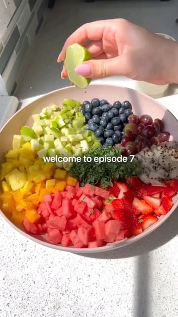

# Follow us @Smoothie.recipe.21day for more tips and recipes about healthy smoothie weight loss every day 💚  

> recipe by [@vegan.tips.recipes](https://www.instagram.com/vegan.tips.recipes/) 
(Vegan.World) - [see original post](https://instagram.com/p/CcHGX46gm5Y)

\
The best fruit salad you’ll ever have 🍓🍊🍌🥝🫐🍇\
\
By @healthygirlkitchen \
\
Fruit I used: \
strawberries, watermelon, oranges, mango, kiwi, apple, blueberries, dragon fruit + fresh mint and lime \
\
Other fruit options:\
cantaloupe, honey dew, bananas, raspberries, blackberries, pears, pineapple, literally any fruit works in this! \
\
*use whatever fruit is accessible to you, your fave fruit or what’s most cost effective for you! \
.\
\
Check the LINK 🔗 in my bio (👉 @smoothie.recipe.21day ) and take the 21-Day Smoothie Diet Challenge TODAY if you want more amazing DETOX recipes like THIS!⁣\
⁣-\
People who complete the challenge lose up to 20 lbs and form long-term healthy eating habits that help them to keep the weight off for good.⁣\
⁣-\
CHECK THE LINK IN MY BIO TO JOIN:⁣\
👉 @smoothie.recipe.21day\
👉 @smoothie.recipe.21day\
👉 @smoothie.recipe.21day\
.\
.\
\#vegan_veganfood \#veganvitamin \#vegancommunity \#veganlifestyle \#veganfoodlovers \#veganshare 