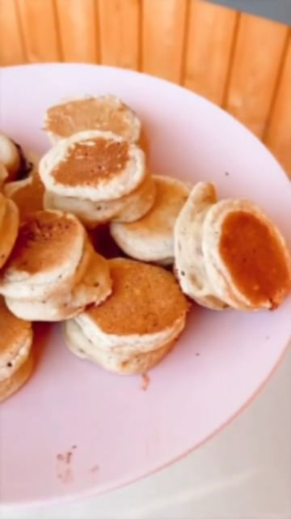

# "GET The Complete Plant Based Cookbook - Over 100+ Delicious Vegan Recipes Including 30-day Meal Plans" LINK IN BIO 🔗 @vegan.tipsvn 

> recipe by [@vegan.tipsvn](https://www.instagram.com/vegan.tipsvn/) 
(Vegan Tips) - [see original post](https://instagram.com/p/CdUMGwzLEfU)

  
Yummiest way to have a 🍌? Either way, these are DELICIOUS, gluten free, a healthier and fun pancake version 😍 They can even be stored to the day after in the fridge, just pop them into a bread toaster 👍🏽 tag someone who should try have their banana like this 🍌  
  
By @fivesechealth  
  
Mini Banana Cakes  
  
- 1 banana  
- 30g vegan chocolate  
- Pancake batter (I used 1/2 cup oat flour + 1/2 cup plant milk + 1 tsp baking powder. Combine and let sit 10 minutes before dipping bananas)  
Cook on medium heat in a non stick pan, 2 minutes on each side  
⁣  
  
.  
.  
\#veganworldshare \#veganlover \#veganislife \#veganfeed \#veganrecovery \#veganhealthy \#veganlifestlye \#veganeasy \#veganproblems \#vegantips \#veganrecepies \#veganrecipeshare \#veganrecipeideas \#simplevegan \#veganrules \#vegandinners \#veganinstaclub \#veganeatsplease \#veganyum \#vegangram \#veganramen \#veganheaven \#veganteen \#vegansoninstagram \#veganraw \#veganrecipies \#veganweightloss \#veganweek \#veganeating   