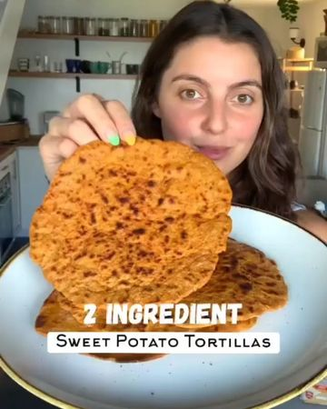

# 2 INGREDIENT SWEET POTATO TORTILLAS! 

> recipe by [@veganbarrel](https://www.instagram.com/veganbarrel/) 
(Being Vegan) - [see original post](https://instagram.com/p/CV8dv39qGlA)

🎉🍠🌱

🤤 These tortillas were honestly sooo delicious and they are super versatile! You can use them for dunking into soups, stew curries and dips, or use them as a flatbread or tortilla!

🔖 Make sure to save this recipe for later!

📸: Videos by @that.veganbabe

✨INGREDIENTS✨
1 medium sized sweet potato (about 1 cup mashed)
3/4 cup whole wheat flour

✅ Cook your sweet potato in the microwave or oven.

🔥 Microwave: poke 20x holes with a fork & microwave 6 mins flipping halfway through!

🙌Oven: Bake at 425f for 55 min

🥄 Let the potato cool slightly, remove the skin and mash with the back of a fork. Then mix in your flour, knead with your hands until fully combined and form a ball.

🔪 Divide the dough into 4 quarters then roll until it is super thin on top of a floured surface - you can use a bottle of vinegar or wine if you don’t have a rolling pin!

😍Pan fry for a few minutes on each side - use more than one pan to make it faster!

💜Enjoy! & have a lovely day!
.
.
.
.
\#sweetpotatotortilla \#2ingredientdough \#easyrecipes \#veganrecipes \#homemadetortillas \#easyvegan \#sweetpotatorecipe \#plantbased \#plantbasedrecipes \#healthyrecipes \#healthysnacks \#vegansnackideas \#veganfoodshare \#healthyveganfood 