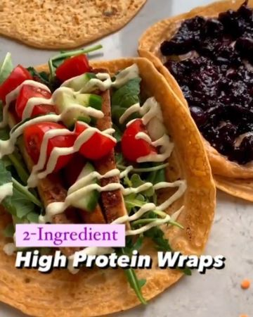

# 🌱🎉💪 Easy Red Lentil Lentil Wraps - High Protein!!! 💚 Who wants to try this recipe? 😋 Details below 👇 by @that.veganbabe 

> recipe by [@veganbarrel](https://www.instagram.com/veganbarrel/) 
(Being Vegan) - [see original post](https://instagram.com/p/CVS1Iy5q2Kl)

🌟SAVE to make later!
🌟FOLLOW ME @veganbarrel for daily vegan recipes and tips 🌱

✨MACROS✨ makes 10
68 cals - 5P - 12C - 0F

🙌 These wraps only require 2 ingredients and are a great snack to keep on hand! You can store them in the fridge for a few days or in the freezer! Use them for sweet or savoury meals!

✨INGREDIENTS✨
1 cup dry red lentils (washed)
2 cups of water

You can also add a dash of salt (this is optional)

✅ Soak the lentils in the water for a minimum of 3 hours. Blend smooth then pan fry for a few mins of each side.

💜Enjoy & thanks for watching!!
.
.
.

\#vegandinner \#vegansnack \#veganeats \#easyveganmeals \#vegansofig \#veganprotein \#whatveganseat \#simplevegan \#veganrecipes\#veganonabudget \#veganlove \#veganfoodlovers \#veganpower \#veganrecipe \#veganfoodlovers \#veganfoodie \#eatmoreplants \#veganfoodporn \#veganfoodshare \#eatplants \#easyvegan \#veganlife \#vegetarianlife ​\#plantbasedmeals \#easyvegan \#veganforhealth \#plantbasedfood \#vegansofinsta \#veganwrap \#veganeats 