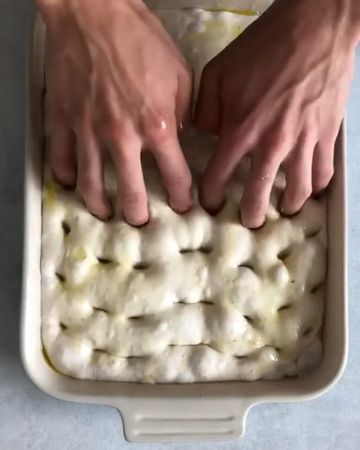

# Homemade Sourdough Focaccia in 30 seconds? Here we go. 

> recipe by [@veganbarrel](https://www.instagram.com/veganbarrel/) 
(Being Vegan) - [see original post](https://instagram.com/p/CVTi8MBKgqW)

\
🌱 By @bakinghermann\
\
Just like the Rye Bread, the focaccia is probably one of the easiest sourdough breads to make. Similar to the rye, it is baked in a dish, meaning that you skip the more challenging stages of shaping it by hand, letting it proof in a basket and then placing it into your casserole. It also means, that you can use a higher hydration, resulting in a well risen bread with a soft inside and a thin crunchy crust.\
\
Traditionally, you’d use honey, which I’ve substituted with sugar. The glucose speeds up the fermentation, creating a beautifully open structured with a noticeable tangy flavour. If you’d like the flavour less dominant, simply reduce the time in the fridge by a couple of hours or leave out the sugar. The focaccia also makes a mean sub, like the Roasted Aubergine Focaccia Sandwich (coming soon 👏)\
\
.\
.\
\
\#tastyvegan \#veganmealshare \#veganrecipeshare \#veganrecipeideas \#veganmealideas \#plantbasedrecipe \#plantbasedmeals \#vegandiet \#veganmom \#veganfoodrecipes \#plantbasedfoodie \#plantbasedmeal \#veganmealprep \#plantbasediet \#healthyveganfood \#veganlifestyleblogger \#plantbasedfoods \#veganbowls \#healthyveganrecipes\
\#veganlover \#veganlife🌱 \#veganfoodpornshare \#vegandinnerideas \#veganfoodies \#eatplantsnotanimials \#whatveganscook \#eeatyourvegetables \#buddhabowls \#vegancookbook 