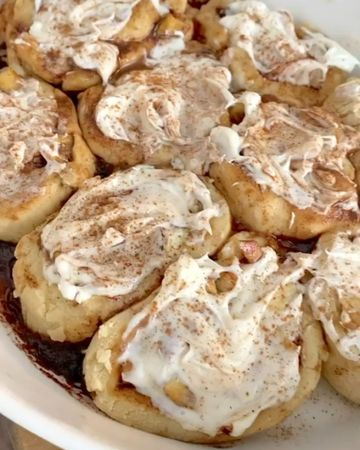

# Typed up a huge list of all the fall recipes I want to make & these APPLE CINNAMON ROLLS just had to come first 🤩🍂 So fun & easy to make 〰️ 4 ingredient dough, 4 ingredient filling 🙌🏼 by @hannahharvestinghealth ! 

> recipe by [@veganbarrel](https://www.instagram.com/veganbarrel/) 
(Being Vegan) - [see original post](https://instagram.com/p/CVVWGGdqCI8)

⠀⠀⠀⠀⠀⠀⠀⠀⠀
Apple Cinnamon Rolls:
i n g r e d i e n t s-
2 cups all purpose flour {I used @bobsredmill 1:1 gf baking flour}
2 tsp. baking powder
1/4 cup melted butter
2/3 cup almond milk
⠀⠀⠀⠀⠀⠀⠀⠀⠀
f i l l i n g-
1/4 cup coconut sugar
1 tbsp. cinnamon
1/2 cup softened butter
1 apple {finely diced}
⠀⠀⠀⠀⠀⠀⠀⠀⠀
d i r e c t i o n s-
1. Preheat oven to 350F and grease a baking dish.
2. In a large bowl, whisk together the flour and baking powder, then stir in the butter and milk.
3. Add a small amount of flour to your surface and roll the dough into a rectangle.
4. In another bowl, stir together the filling ingredients, then spread over the dough until it’s fully covered.
5. Roll it up, cut into 8-9 small cinnamon rolls, and bake for 23- 25 minutes! {Topped with frosting and extra cinnamon} 