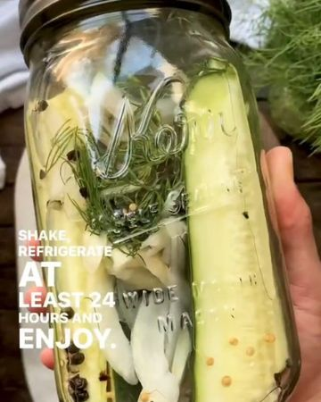

# HOMEMADE PICKLES!🥒 Follow @veganbarrel for more exciting and delishous vegan recipes 🤤 

> recipe by [@veganbarrel](https://www.instagram.com/veganbarrel/) 
(Being Vegan) - [see original post](https://instagram.com/p/CVWKJbwq6nE)

This recipe is definitely gonna be a big dill in your house 😎 Whether you're looking for a healthy, delicious snack or a new tasty addition to your salad, these homemade dill pickles can do the job. Fun fact: A whole cucumber is just 16 calories and is actually 95% water 💦 Cucumbers can also be grown anywhere, so if you've always dreamt about enjoying the convenience of a home garden, this veggie is the perfect place to start! ⁠
⁠
What you'll need 🥒⁠
- ½ sweet vidalia onion⁠
- 6-8 sprigs fresh dill⁠
- 6 cloves smashed garlic⁠
- 1 tsp whole peppercorns⁠
- ½ tsp mustard seeds⁠
- 1 cup white vinegar⁠
- 1 cup water⁠
- 2 tbsp sugar⁠
- 2 tsp kosher salt⁠
.
.⁠
📹 Produced by @get.plant.ed / 🧑‍🍳 @eat_figs_not_pigs⁠
.⁠
.⁠
\#GetPlanted \#FuckMeatEatPlants \#FuckDairy \#pickles \#dillpickles \#homemadepickles \#makeyourown \#growyourown \#growyourownfood \#growyourownveggies \#cucumbers \#veganfortheplanet \#plantbasedrecipes \#plantbaseddiet \#veganrecipes \#plantbasednutrition \#vegansofig \#whatveganseat 