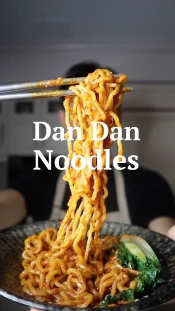

# DAN DAN NOODLES (擔擔麵) #VEGAN.🥢Quite possibly one of the greatest Sichuan dishes to ever live. This is a Taiwanese take. Nothing like a spicy, nutty, and umami bowl of noodles on a cold winter day — one slurp will warm you right up & tuck you into bed. I can confirm because I’m still on the floor right now.😌 By @chez.jorge 

> recipe by [@veganbowlsrecipes](https://www.instagram.com/veganbowlsrecipes/) 
(Vegan Bowls Recipes) - [see original post](https://instagram.com/p/Ca9z_JgqVoH)

THE RECIPE (for two):
4 cloves garlic, grated
2 tablespoons chili flakes
1 tablespoon sesame seeds
2 teaspoons ground Sichuan pepper
4 tablespoons vegetable oil
4 tablespoons soy sauce
2 tablespoons dark brown sugar
1.5 tablespoons peanut butter (or sesame paste)
2 teaspoons black vinegar

**For each bowl, use 180 grams of noodles, 4-5 tablespoons of spicy sauce, and about 1/4 cup of noodle cooking water. Top with bok choy, vegan protein, crushed peanuts, scallions, etc.

Full written recipe link in bio (it includes a vegan minced pork also). BIG LOVE, George. x 