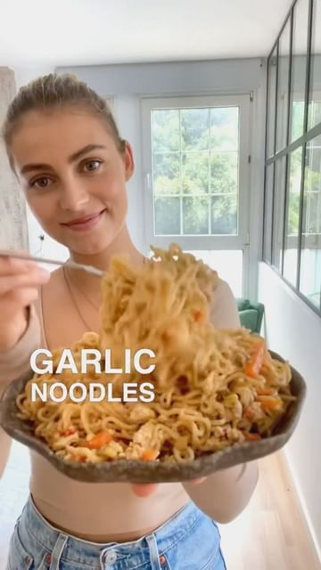

# These Garlic noodles turned out soo good!! Been trying to add some creaminess to my noodle dishes, without having to use peanut butter in every recipe. We did it! 

> recipe by [@vegancarnival](https://www.instagram.com/vegancarnival/) 
(🍅 Vegan Foodie 💚 Green Life) - [see original post](https://instagram.com/p/CdNxKFlqqpM)

  
Ingredients (3 servings)  
1 tbsp sesame oil  
2 spring onions  
1 chili  
6 garlic cloves  
1 tbsp minced ginger  
6 tbsp soy sauce  
6 tbsp water  
3 tbsp maple syrup  
2 tbsp lemon juice  
1 tbsp tahini  
  
Other:  
1 big carrot  
170g extra firm tofu  
170g dry noodles  
  
Instructions:  
1. Start by chopping your carrot into thin sticks.
  
2. Fry the carrot, finely chopped spring onions, garlic, chilli and ginger for a couple of minutes.  
3. Scramble the tofu with your hands into the skillet and fry for another 5 minutes.  
4. Add the remaining ingredients for the sauce.  
5. Cook your noodles according to package instructions and add it to the skillet.  
6. Mix everything together and enjoy!
!  
.  
Don't forget to like, comment,follow and 🔔 @vegancarnival  
➖➖➖➖➖➖➖➖➖➖➖➖➖➖➖➖➖  
credit: @eatmoreplants.no 📷  
double tap the picture to show your love to Jenny🙋🏼‍♀️ Plant-Based Recipes by liking 💖 the post  
for full recipes and more great posts, head to @eatmoreplants.no profile and start following  
➖➖➖➖➖➖➖➖➖➖➖➖➖➖➖➖➖  
⭐ Tag us on your best posts for a chance to be feature ⭐  
➖➖➖➖➖➖➖➖➖➖➖➖➖➖➖➖➖  
.  
.  
.  
.  
.  
.  
.  
.  
.  
.  
.  
.  
.  
.  
.  
\#noodle \#veganrecipes \#noodles \#easydinner \#veganfood \#vegancarnival \#vegandinner \#veganfood \#veganrecipe \#plantbaseddiet \#veganfoodie \#veganlunch \#veganfamily \#simplevegan \#plantbasedvegan \#easyveganmeals \#healthyfood \#whatveganseat \#veganrecipe \#letscookvegan \#veganfoodblogger \#veganfoodspot \#veganfoodspace \#veganfoodporn \#veganfoodie \#veganideas \#veganmeals \#healthyvegan \#vegancommunity \#veganlife   