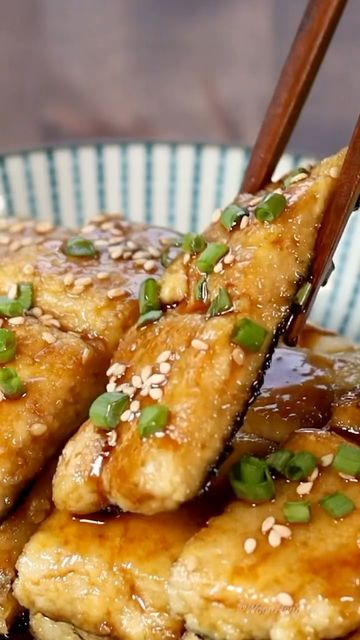

# Vegan Unagi (Eel)😋素鳗鱼 with an unbelievable scrumptious sauce. Tag some friends to make this over the weekend.🤗⁣ 

> recipe by [@vegancarnival](https://www.instagram.com/vegancarnival/) 
(🍅 Vegan Foodie 💚 Green Life) - [see original post](https://instagram.com/p/CU-7MSxKwj4)

.\
Don't forget to like, comment,follow and 🔔 @vegancarnival\
➖➖➖➖➖➖➖➖➖➖➖➖➖➖➖➖➖\
credit: @woon.heng 📷\
double tap the picture to show your love to WoonHeng ❣️🌱 by liking 💖 the post\
for full recipes and more great posts, head to @woon.heng profile and start following\
➖➖➖➖➖➖➖➖➖➖➖➖➖➖➖➖➖\
⭐ Tag us on your best posts for a chance to be feature ⭐\
➖➖➖➖➖➖➖➖➖➖➖➖➖➖➖➖➖\
.\
.\
.\
.\
.\
.\
.\
.\
.\
.\
.\
.\
.\
.\
.\
\#veganjapan \#unagidon \#plantbased \#f52grams \#vegansofig \#tofu \#bestofvegan \#makesmewhole \#japanesefood \#healthyeating \#woonheng \#veganfood \#seaspiracy \#buzzfeedfood \#asianfoodporn \#lowcarbrecipes \#全素 \#seaweed \#fitfoodie \#unagi \#potato \#compassionateliving \#vegancarnival \#veganismo \#veganaf \#vegandinner \#veganskincare \#vegana \#veganlunch \#veganrecipe 