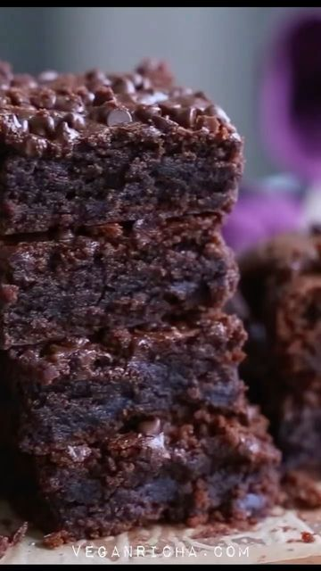

# 🍫Lentil Brownies! Yes you can put any legume in a brownie. I’ve got chickpea brownies on the blog too! I never got on the black bean brownie train because the bean skin texture and flavor is obvious and hello bloat. 🔥These are super Fudgy and easy on the tummy! 

> recipe by [@vegancarnival](https://www.instagram.com/vegancarnival/) 
(🍅 Vegan Foodie 💚 Green Life) - [see original post](https://instagram.com/p/CY8kE2yJmXj)

Recipe linked in stories or Google “vegan richa lentil brownies “

https://www.veganricha.com/lentil-brownies/
.
Don't forget to like, comment,follow and 🔔 @vegancarnival
➖➖➖➖➖➖➖➖➖➖➖➖➖➖➖➖➖
credit: @veganricha 📷
double tap the picture to show your love to Vegan Richa | By Richa Hingle by liking 💖 the post
for full recipes and more great posts, head to @veganricha profile and start following
➖➖➖➖➖➖➖➖➖➖➖➖➖➖➖➖➖
⭐ Tag us on your best posts for a chance to be feature ⭐
➖➖➖➖➖➖➖➖➖➖➖➖➖➖➖➖➖
.
.
.
.
.
.
.
.
.
.
.
.
.
.
.
\#lentilbrownies \#veganbrownies \#veganrecipes \#vegan \#glutenfreevegan \#vegancarnival \#healthymeal \#healthyrecipe \#easyrecipe \#simplerecipe \#instahealth \#instafit \#fitnessjourney \#fitgram \#vegetarian \#veganrecipes \#vegansofig \#veganlife \#vegano \#veganism \#vegansofinstagram \#veganvitamin \#veganlifestyle \#vegans \#vegancommunity \#veganeats \#veganbreakfast \#veganuk \#veganismo \#veganaf 