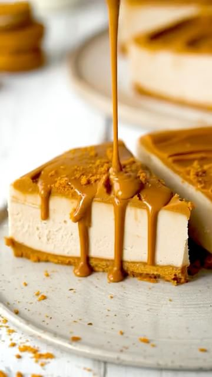

# Vegan Lotus Biscoff Cheesecake, if you love cookie butter you will not want to miss this one! That deep caramelised biscuit flavour is so good in this recipe. It’s got an easy no-bake cookie crust, creamy dairy-free biscoff cheesecake filling and lashings of creamy biscoff spread.  

> recipe by [@vegancarnival](https://www.instagram.com/vegancarnival/) 
(🍅 Vegan Foodie 💚 Green Life) - [see original post](https://instagram.com/p/CbwrV0dqkfX)

\
Recipe Google “addicted to dates biscoff cheesecake”\
\
.\
Don't forget to like, comment,follow and 🔔 @vegancarnival\
➖➖➖➖➖➖➖➖➖➖➖➖➖➖➖➖➖\
credit: @addictedtodates 📷\
double tap the picture to show your love to Christina L | Vegan Recipes by liking 💖 the post\
for full recipes and more great posts, head to @addictedtodates profile and start following\
➖➖➖➖➖➖➖➖➖➖➖➖➖➖➖➖➖\
⭐ Tag us on your best posts for a chance to be feature ⭐\
➖➖➖➖➖➖➖➖➖➖➖➖➖➖➖➖➖\
.\
.\
.\
.\
.\
.\
.\
.\
.\
.\
.\
.\
.\
.\
.\
\#vegancheesecake \#biscoffcheesecake \#easyrecipes \#veganrecipe \#vegandesserts \#nobakecheesecake \#nobake \#vegancarnival \#veganfoodporn \#veganfoodie \#veganideas \#veganmeals \#healthyvegan \#vegancommunity \#veganlife \#plantbased \#plantprotein \#veganeats \#veganinspo \#healthy \#healthymeal \#healthyrecipe \#easyrecipe \#simplerecipe \#instahealth \#instafit \#fitnessjourney \#fitgram \#vegetarian \#veganrecipes 