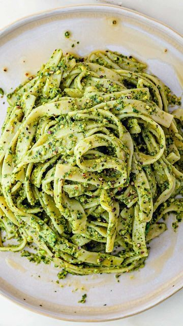

# Pistachio Pesto Pasta by @sovegan! 😋 

> recipe by [@vegancommunity](https://www.instagram.com/vegancommunity/) 
(Vegans Community 🌱) - [see original post](https://instagram.com/p/CVcnnBgKVFo)

  
Check out Ben & Roxy's amazing recipe below:  
  
Serves 4  
  
🌿 320g / 11.3oz pasta  
🌿 70g / 2.5oz pistachios, shells removed  
🌿 2 garlic cloves  
🌿 3 tbsp nutritional yeast  
🌿 2 bunches of fresh basil, stalks removed  
🌿 1 handful of fresh mint, stalks removed  
🌿 1/4 tsp chilli flakes  
🌿 1 lime, juice only  
🌿 150ml / 5.1 fl.oz extra virgin olive oil  
🌿 salt + pepper  
  
Cook the pasta in salted boiling water until al dente, then drain and reserve the pasta water  
  
Add the remaining ingredients to a food processor including 1/2 tsp salt and a generous pinch of pepper.  
  
Process until smooth. When the pasta has finished cooking, add 2-3 tbsp of the paster water to help reduce the thickness of the pesto.  
  
Combine the pasta and the pesto. We like to top with freshly ground black pepper and a few basil and mint leaves.  
  
Enjoy!  
  
Head over to goodoldvegan.com for more tasty vegan recipes! Like to be featured? Tag @goodoldvegan and use \#goodoldvegan in your posts. 🌱   